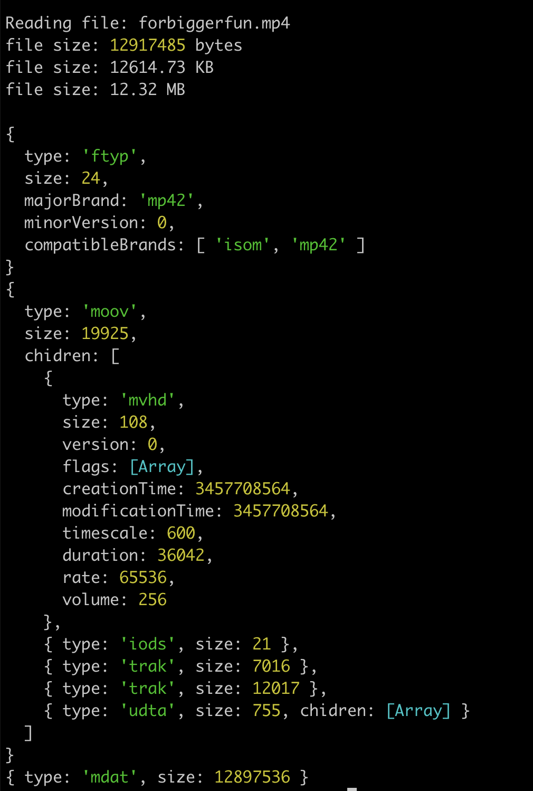

Understanding MPEG Boxes/Atoms with Node.JS
===

A sample code repo to help understand the structure of MPEG video containers.

Inspired by:
- https://dev.to/alfg/a-quick-dive-into-mp4-57fo
- https://github.com/mshafiee/mp4/tree/master/box

### Step 1 - install
>$ npm install

### Step 2 - run
>$ npm run start

### Step 3 - play
>$ npm run play
Play with the code yourself!

